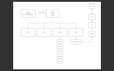
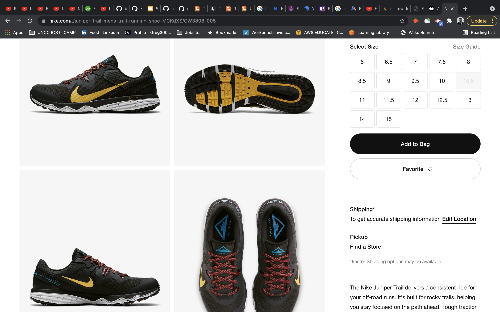

# Greg's XPortfolio

## [Portfolio](https://gregpetropoulos.dev)
## License

## Description
I created a portfolio to show my latest projects and newly learned technologies. I am always seeking ways to improve knowledge, skills, and creativity. Check out my portfolio using React hooks, JavaScript, bootstrap, CSS, HTML and npm library. My portfolio is a M.E.R.N full stack app deployed on Heroku with a personal domain name.

# Demo
## Landing
## Home
## Nav Menu
## About
## Projects
## Contact
## Experimental

## Table of Contents 
* [License](#license)
* [Description](#description)
* [Demo](#demo)
* [Concepts](#concepts)
* [Technologies](#technologies)
* [Structure](#structure)
* [Scripts](#scripts)
* [Packages](#packages)
* [Database](#database)
* [Features](#features)
* [Test](#test)
* [Credits](#credits)
* [Code of Conduct](#code-of-conduct)

## Concepts
Setting the initial concept to give a clear direction on where to start and how to implement the Model Views Controllers paradigm.

Wireframe

### UI
The UI/UX came to by inspiration of my favorite running shoes and the colors Nike used for their Juniper line
Theme colors based off a Nike Juniper shoe

- yellow
#d6b850
- blue
#08a7ce
- red
#7f3331
- faded black
#0e2124

## Technologies
- React
- npm
- JavaScript
- JSX
- Bootstrap
- react strap
- CSS

## Structure
MVC

## Scripts
Standard Create React App

## Packages
    "axios": "^0.21.1",
    "bootstrap": "^4.6.0",
    "dotenv": "^10.0.0",
    "react": "^17.0.2",
    "react-bootstrap": "^1.6.1",
    "react-dom": "^17.0.2",
    "react-hook-form": "^7.8.1",
    "react-intersection-observer": "^8.32.0",
    "react-motion": "^0.5.2",
    "react-router-dom": "^5.2.0",
    "react-scripts": "4.0.3",
    "styled-components": "^5.3.0",
    "typewriter-effect": "^2.18.0",

## Database
MongoDB
## Features
- Hamburger
- Full Page Menu
- Button and Link animation
- Barcode email
- SVG Experiment
## Test
Smoke test
## Credits

[Typewriter Effect](https://www.npmjs.com/package/typewriter-effect)

[Animated Drawing Effect](https://www.dlford.io/draw-animation-svg-react-hooks/)

[SVG Set Up](https://react-svgr.com/playground/)

Full Stack Web Developer in React
[Inspirational Portfolio](https://prashantsani.com/) in React with SVG animation

### [Greg's Portfolio](https://gregpetropoulos.dev)